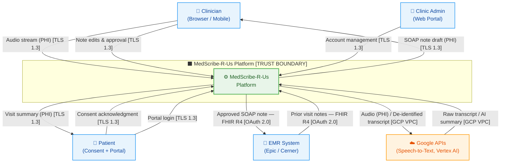

# Data Flow Diagram — Level 0 (Context Diagram)

> **Fictional company — portfolio/educational purposes only.**
>
> **Document Status:** Draft v1.0 | Owner: AppSec | Phase: P1

---

## Overview

The L0 diagram treats the entire MedScribe-R-Us platform as a single process.
It establishes the system boundary, identifies all external entities, and maps
the high-level data flows crossing the trust boundary.

This is the entry point for the threat model. Every data flow at L0 is
decomposed into component-level flows in the L1 diagram.

---

## Diagram

---

## Trust Boundaries

| Boundary | Description | Crossing Data |
|---|---|---|
| **Internet perimeter** | Between external entities and the platform | Audio (PHI), FHIR resources, user sessions |
| **GCP API boundary** | Between MedScribe internal services and Google APIs | Audio (PHI) to Speech-to-Text; de-identified transcript to Vertex AI |
| **EMR integration boundary** | Between MedScribe and Epic/Cerner FHIR endpoints | Approved SOAP notes (PHI) outbound; prior visit notes (PHI) inbound |

---

## External Entities

| Entity | Description | Trust Level |
|---|---|---|
| **Clinician** | Licensed healthcare provider using the MedScribe portal | Authenticated; low inherent trust (credentials can be compromised) |
| **Patient** | Individual whose appointment is being recorded | Authenticated (portal); implicit consent for recording |
| **EMR System** | Epic or Cerner FHIR R4 endpoints at the customer health system | Authenticated via SMART on FHIR; treated as semi-trusted |
| **Google APIs** | Speech-to-Text and Vertex AI (Gemini) | Third-party; subject to GCP BAA; de-identified data only to Vertex AI |
| **Clinic Admin** | Health system administrator managing clinician accounts | Authenticated; scoped to their tenant |

---

## Key Observations at L0

1. **PHI crosses the internet boundary on every appointment recording** — audio streams from the clinician's device to MedScribe over TLS 1.3. This is the highest-volume PHI flow in the system.

2. **Google APIs are the only third-party that receives MedScribe data** — Speech-to-Text receives raw audio (PHI); Vertex AI receives only de-identified transcripts. The PHI scrubbing layer (decomposed in L2) is the control that enforces this separation.

3. **The EMR integration is bidirectional** — MedScribe both reads from and writes to Epic/Cerner. Inbound prior notes are ingested as LLM context; outbound approved notes are written to the patient record. Both directions carry PHI and both require SMART on FHIR authorization.

4. **No patient directly interacts with the recording** — the patient's primary interaction is consent and optional portal access to their visit summary. The clinician is the primary operator of the recording session.
