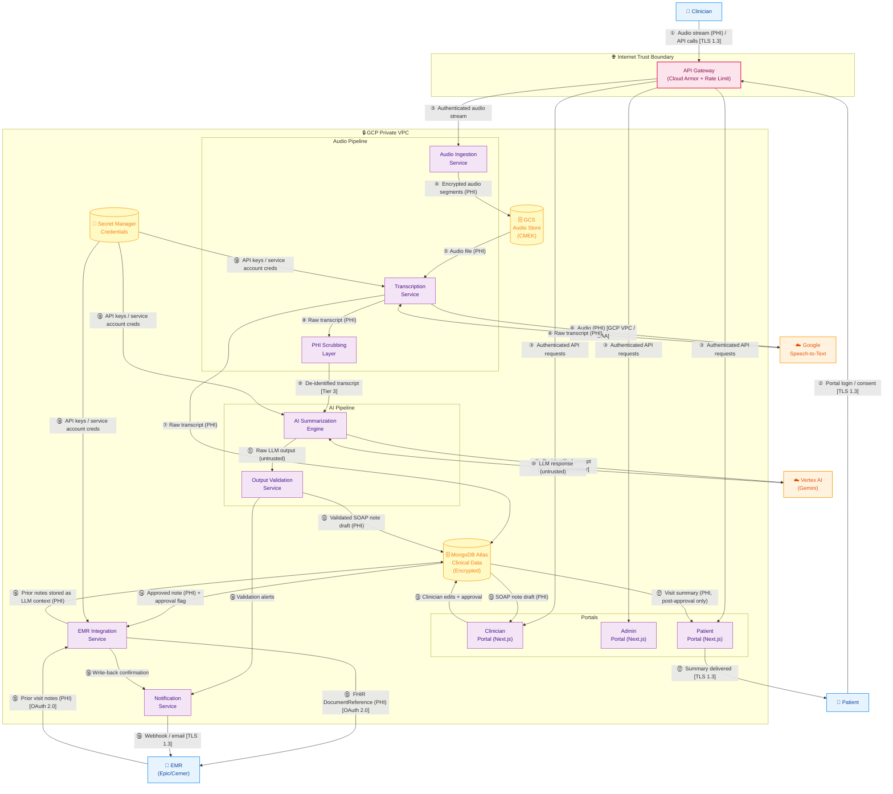

# Data Flow Diagram — Level 1 (Component Diagram)

> **Fictional company — portfolio/educational purposes only.**
>
> **Document Status:** Draft v1.0 | Owner: AppSec | Phase: P1

---

## Overview

The L1 diagram decomposes the MedScribe-R-Us platform into its component services,
data stores, and internal data flows. Trust boundaries are drawn explicitly.

This diagram is the primary reference for the STRIDE threat analysis. Each numbered
data flow in the diagram corresponds to a row in the STRIDE threat register.

---

## Diagram

---

## Data Flow Index

| Flow | From | To | Data | PHI? |
|---|---|---|---|---|
| ① | Clinician | API Gateway | Audio stream, API calls | ✅ Yes |
| ② | Patient | API Gateway | Login, consent | ⚠️ PII |
| ③ | API Gateway | Internal services | Authenticated requests | Varies |
| ④ | Audio Ingestion | GCS | Encrypted audio segments | ✅ Yes |
| ⑤ | GCS | Transcription Service | Audio file | ✅ Yes |
| ⑥ | Transcription ↔ Google STT | Raw audio / raw transcript | ✅ Yes |
| ⑦ | Transcription | MongoDB | Raw transcript | ✅ Yes |
| ⑧ | Transcription | PHI Scrubbing Layer | Raw transcript | ✅ Yes |
| ⑨ | PHI Scrubbing | AI Summarization | De-identified transcript | ❌ Tier 3 |
| ⑩ | AI Summarization ↔ Vertex AI | De-identified prompt / LLM response | ❌ Tier 3 |
| ⑪ | AI Summarization | Output Validation | Raw LLM output (untrusted) | ⚠️ Potential |
| ⑫ | Output Validation | MongoDB | Validated SOAP note draft | ✅ Yes |
| ⑬ | MongoDB ↔ Clinician Portal | SOAP note draft / clinician edits | ✅ Yes |
| ⑭ | MongoDB | EMR Integration | Approved note + approval flag | ✅ Yes |
| ⑮ | EMR Integration ↔ Epic/Cerner | FHIR DocumentReference / prior notes | ✅ Yes |
| ⑯ | EMR Integration | MongoDB | Prior notes as LLM context | ✅ Yes |
| ⑰ | MongoDB → Patient Portal → Patient | Visit summary (post-approval) | ✅ Yes |
| ⑱ | Secret Manager | Internal services | API keys, service account credentials | 🔵 Internal |
| ⑲ | Services | Notification Service → EMR | Webhooks, write-back confirmations | ⚠️ PII |

---

## Trust Boundaries at L1

| Boundary | Location | What Crosses It |
|---|---|---|
| **Internet perimeter** | Between external entities and API Gateway | Flows ①, ②, ⑰ |
| **GCP API boundary** | Between VPC and Google APIs | Flows ⑥ (PHI), ⑩ (de-identified) |
| **EMR integration boundary** | Between EMR Integration Service and Epic/Cerner | Flow ⑮ |
| **PHI scrubbing boundary** | Between PHI data and LLM submission | Flow ⑨ — critical single point of control |
| **Approval gate boundary** | Between MongoDB and EMR Integration | Flow ⑭ — enforced server-side |

---

## Key Observations at L1

1. **Flow ⑨ is the most critical control point** — the PHI scrubbing boundary between raw transcript data and Vertex AI. A failure here sends PHI to a third-party LLM API. This generates the highest-severity threat findings in the STRIDE analysis.

2. **Flow ⑯ creates an indirect injection surface** — prior EMR notes ingested as LLM context come from Epic/Cerner, a system MedScribe does not control. Adversarially crafted prior notes become an injection vector into the AI pipeline.

3. **Flow ⑭ must enforce the approval gate server-side** — the approval flag on the approved note must be validated by the EMR Integration Service, not trusted from the client. Frontend-only enforcement is bypassable via direct API calls.

4. **Secret Manager (flow ⑱) is a high-value target** — compromise of Secret Manager credentials gives an attacker access to the Vertex AI API key, the MongoDB connection string, and the EMR OAuth client secret simultaneously.
