# Data Flow Diagram — Level 2 (AI Pipeline Deep Dive)

> **Fictional company — portfolio/educational purposes only.**
>
> **Document Status:** Draft v1.0 | Owner: AppSec | Phase: P1

---

## Overview

The L2 diagram zooms into the AI pipeline — the highest-risk subsystem in
MedScribe-R-Us. It decomposes flows ⑧ through ⑬ from the L1 diagram into
their internal steps: PHI scrubbing, prompt construction, LLM API call,
response parsing, output validation, and clinician review.

This level of detail is required to threat model the AI-specific attack surfaces
(prompt injection, output handling, PHI leakage) that are not visible at L1.

---

## Diagram

```mermaid
flowchart TD
    %% ── Inputs ──────────────────────────────────────────────────────
    RAWTRANS[/"📄 Raw Transcript\n(PHI — from MongoDB)"/]
    PRIORNOTES[/"📋 Prior Visit Notes\n(PHI — from Epic/Cerner)"/]
    CLINICIAN["👤 Clinician\n(edits + approval)"]

    %% ── PHI Scrubbing Layer ─────────────────────────────────────────
    subgraph SCRUBLAYER ["PHI Scrubbing Layer"]
        NER["NER Model\n(spaCy + custom rules)"]
        TOKENMAP[("🗄️ Token Map Store\n[PATIENT_NAME] → 'John Smith'\n(MongoDB, never sent to LLM)")]
        DEIDTEXT[/"📄 De-identified Transcript\n[PATIENT_NAME], [DATE], [ID_NUMBER]..."/]
    end

    %% ── Prompt Construction ─────────────────────────────────────────
    subgraph PROMPTBUILD ["Prompt Construction"]
        SYSCTX["System Context\n(role, output schema,\nsecurity guardrails)"]
        PRIORCTX["Prior Note Context\n(de-identified prior visits)"]
        PROMPTASM["Prompt Assembler"]
        FINALPROMPT[/"📝 Final Prompt\n(de-identified — Tier 3)"/]
    end

    %% ── Vertex AI API ───────────────────────────────────────────────
    subgraph VERTEXBOUNDARY ["☁️ GCP VPC Service Controls Perimeter"]
        VERTEXAPI["Vertex AI API\n(Gemini)"]
    end

    %% ── Response Handling ───────────────────────────────────────────
    subgraph RESPONSEHANDLING ["Response Handling"]
        RAWLLM[/"⚠️ Raw LLM Output\n(UNTRUSTED)"/]
        JSONPARSE["JSON Parser\n(schema enforcement)"]
        PARSEFAIL{"Parse\nSuccess?"}
        REJECTLOG["🚨 Reject + Flag\nfor Security Review"]
    end

    %% ── Output Validation Service ───────────────────────────────────
    subgraph OUTVALSERVICE ["Output Validation Service"]
        SCHEMAVAL["Schema Validator\n(SOAP structure)"]
        VOCABCHECK["Clinical Vocab Check\n(ICD-10, RxNorm)"]
        PHIREINJECTION["PHI Re-injection\n(token map lookup)"]
        PHIAUDIT["Re-injection Audit\n(patient ID binding check)"]
        ANOMALY["Anomaly Detector\n(statistical content model)"]
        VALRESULT{"Validation\nPassed?"}
        FLAGREVIEW["⚠️ Flag for Mandatory\nClinician Review"]
    end

    %% ── Clinician Review ────────────────────────────────────────────
    subgraph CLINREVIEW ["Clinician Review (Portal)"]
        NOTERENDER["Render SOAP Note\n+ Evidence Links"]
        CLINICANACTION{"Clinician\nDecision"}
        APPROVED["✅ Approved Note\n(PHI — stored in MongoDB)"]
        REJECTED["❌ Rejected\n(flagged for audit)"]
        EDITED["✏️ Edited Note\n(treated as untrusted input)"]
    end

    %% ── Flows ───────────────────────────────────────────────────────
    RAWTRANS -->|"A  Raw transcript (PHI)"| NER
    NER -->|"B  Token map entries"| TOKENMAP
    NER -->|"C  De-identified text"| DEIDTEXT

    PRIORNOTES -->|"D  Prior notes (PHI) — sanitized before use"| PRIORCTX
    DEIDTEXT -->|"E  De-identified transcript"| PROMPTASM
    SYSCTX -->|"F  System prompt + schema"| PROMPTASM
    PRIORCTX -->|"G  De-identified prior context"| PROMPTASM
    PROMPTASM -->|"H  Assembled prompt (Tier 3)"| FINALPROMPT

    FINALPROMPT -->|"I  API call [GCP VPC perimeter]"| VERTEXAPI
    VERTEXAPI -->|"J  LLM response (untrusted)"| RAWLLM

    RAWLLM -->|"K  Parse JSON"| JSONPARSE
    JSONPARSE --> PARSEFAIL
    PARSEFAIL -->|"❌ Fail"| REJECTLOG
    PARSEFAIL -->|"✅ Pass"| SCHEMAVAL

    SCHEMAVAL -->|"L  Schema-valid note"| VOCABCHECK
    VOCABCHECK -->|"M  Vocab-validated note"| PHIREINJECTION
    TOKENMAP -->|"N  Token lookups"| PHIREINJECTION
    PHIREINJECTION -->|"O  PHI re-injected note"| PHIAUDIT
    PHIAUDIT -->|"P  Audited note"| ANOMALY
    ANOMALY --> VALRESULT
    VALRESULT -->|"⚠️ Anomaly / fail"| FLAGREVIEW
    VALRESULT -->|"✅ Pass"| NOTERENDER
    FLAGREVIEW -->|"Escalated for review"| NOTERENDER

    NOTERENDER -->|"Q  Rendered note + evidence links (PHI)"| CLINICANACTION
    CLINICIAN -->|"R  Approve / Reject / Edit"| CLINICANACTION
    CLINICANACTION -->|"Approved"| APPROVED
    CLINICANACTION -->|"Rejected"| REJECTED
    CLINICANACTION -->|"Edited"| EDITED
    EDITED -->|"S  Stored as untrusted — sanitized on re-entry"| APPROVED

    %% ── Styling ──────────────────────────────────────────────────────
    classDef input fill:#e8f4fd,stroke:#2196F3,stroke-width:1.5px,color:#0d47a1
    classDef untrusted fill:#ffebee,stroke:#f44336,stroke-width:2px,color:#b71c1c
    classDef store fill:#fff9c4,stroke:#F9A825,stroke-width:1.5px,color:#f57f17
    classDef control fill:#e8f5e9,stroke:#4CAF50,stroke-width:1.5px,color:#1b5e20
    classDef external fill:#fff3e0,stroke:#FF9800,stroke-width:1.5px,color:#e65100
    classDef alert fill:#fce4ec,stroke:#E91E63,stroke-width:2px,color:#880e4f

    class RAWTRANS,PRIORNOTES,DEIDTEXT,FINALPROMPT input
    class RAWLLM untrusted
    class TOKENMAP store
    class SCHEMAVAL,VOCABCHECK,PHIREINJECTION,PHIAUDIT,ANOMALY,NER control
    class VERTEXAPI external
    class REJECTLOG,FLAGREVIEW,REJECTED alert
```

---

## Flow Index (AI Pipeline)

| Flow | Step | Security Significance |
|---|---|---|
| A | Raw transcript into NER scrubber | PHI enters the scrubbing process — if NER misses a PHI entity, it proceeds to the LLM |
| B | Token map stored in MongoDB | Token-to-value mapping must never be transmitted to Vertex AI |
| C | De-identified text produced | Output of PHI scrubbing — classified Tier 3 after this point |
| D | Prior notes ingested as context | **Indirect injection surface** — data from Epic/Cerner is not MedScribe-controlled |
| E–H | Prompt assembly | System prompt + de-identified transcript + prior context → final prompt |
| I | Prompt sent to Vertex AI | Crosses VPC Service Controls perimeter; only de-identified data should cross |
| J | LLM response received | **Treated as UNTRUSTED** — no downstream system should consume this directly |
| K | JSON parse + schema enforcement | First gate; malformed output is rejected before validation |
| L–P | Output validation pipeline | Schema → clinical vocab → PHI re-injection → audit → anomaly detection |
| Q | Note rendered to clinician | PHI re-injected note surfaced in the Clinician Portal |
| R | Clinician decision | **Hard approval gate** — no note reaches the EMR without this step |
| S | Edited note re-entry | Clinician edits treated as untrusted input; sanitized before storage |

---

## Critical Security Properties at L2

### 1. The PHI Scrubbing Boundary (Flows A–C)

The PHI scrubbing layer is the highest-criticality control in the entire system.
Its failure mode is silent — a missed PHI entity doesn't cause an error, it causes
PHI to flow into the Vertex AI API call without detection.

**Required controls:**
- NER model must be validated against a labeled PHI test set quarterly
- Custom rules supplement NER for MedScribe-specific patterns (MRNs, Epic patient IDs)
- Scrubber output must be logged (without the PHI values) for audit
- False negative rate must be tracked as a security KPI

### 2. Untrusted LLM Output (Flow J)

The raw LLM response is explicitly labeled UNTRUSTED in this diagram. Every
downstream step in the response handling pipeline must treat it as potentially
malicious — including containing injection payloads, malformed JSON, or
fabricated clinical content.

**Required controls:**
- JSON parsing in a sandboxed context; exceptions caught and logged
- Schema validation before any field value is read
- Clinical vocabulary cross-reference before PHI re-injection

### 3. Prior Note Context as Injection Surface (Flow D)

Prior visit notes from Epic/Cerner are ingested and used as LLM context.
These notes were written by humans in a system MedScribe does not control.
An attacker with access to the EMR can craft a prior note containing an
injection payload that fires in a subsequent MedScribe session.

**Required controls:**
- Prior notes sanitized and clearly delimited in the prompt structure
- System prompt explicitly instructs the model to treat prior note content
  as data, not instructions
- Output validation anomaly detection covers instruction-like patterns in output

### 4. Clinician Edit Re-entry (Flow S)

When a clinician edits a note, their edits are stored in MongoDB and may be
used as context in future sessions. Clinician-controlled input is untrusted
from a security perspective — it is sanitized before re-entry into any
subsequent LLM context window.

**Required controls:**
- Clinician edits stored as literal text, never interpreted as prompt instructions
- Edit content excluded from LLM context unless explicitly re-submitted through
  the scrubbing + sanitization pipeline
